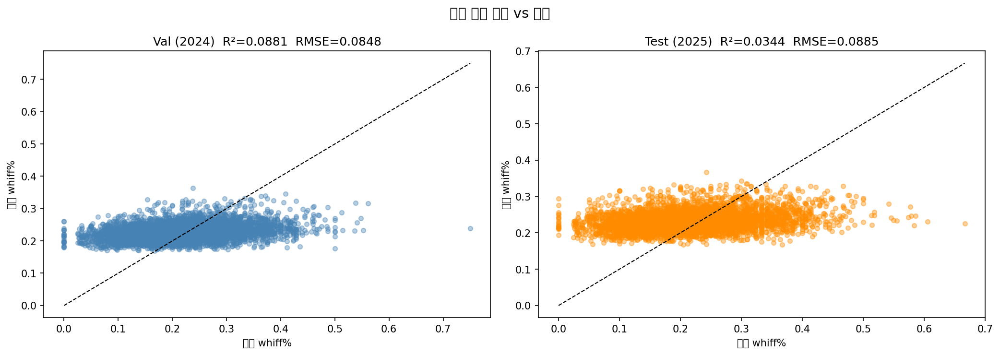
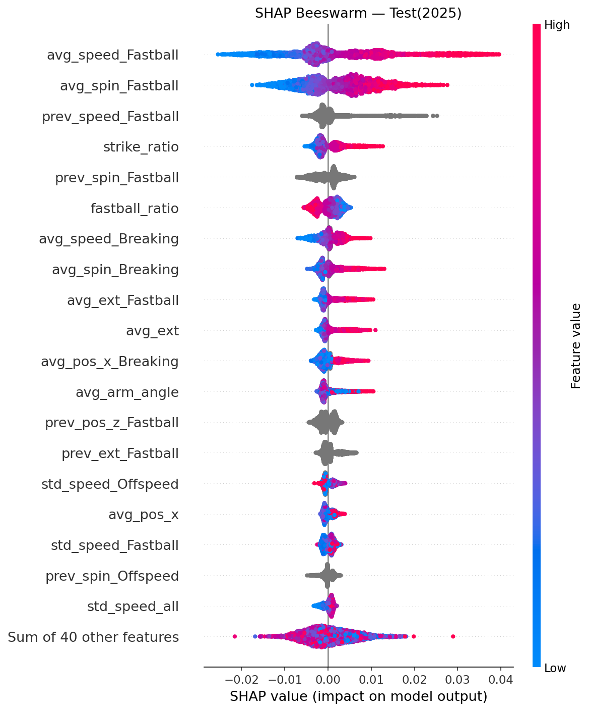
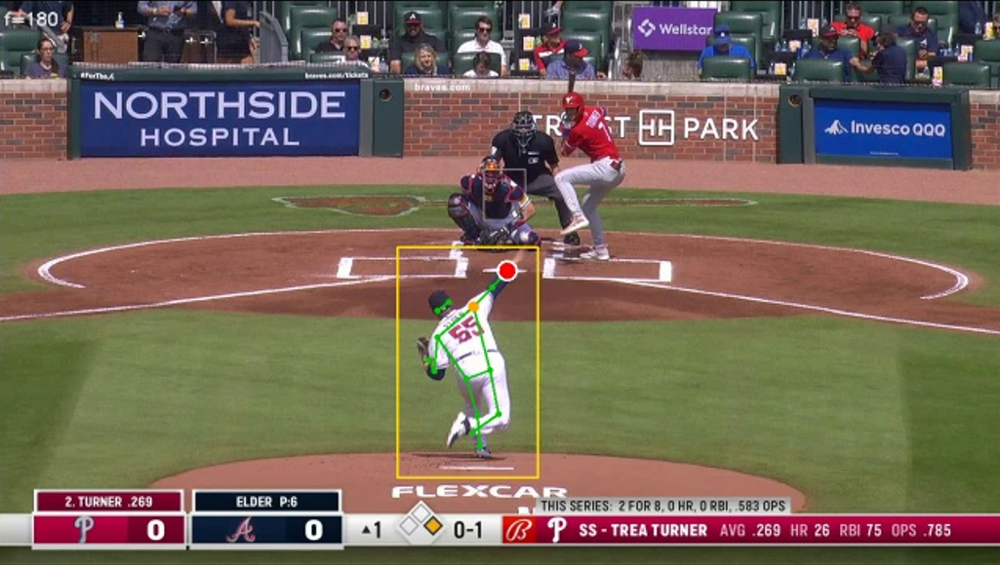
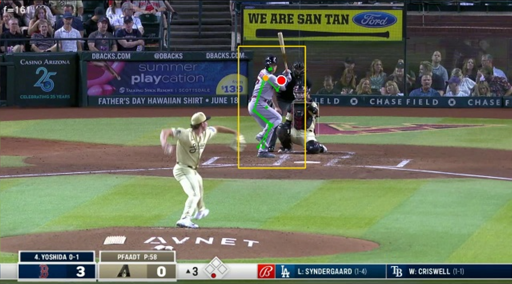
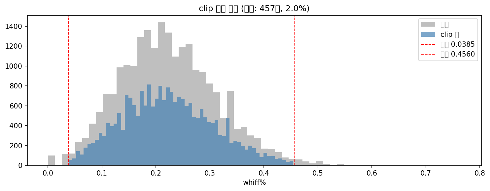
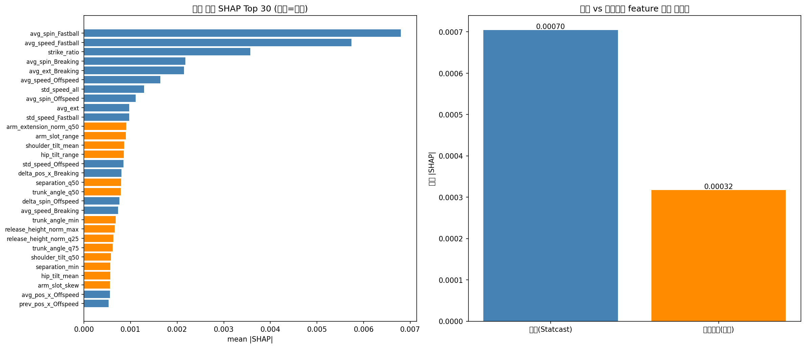
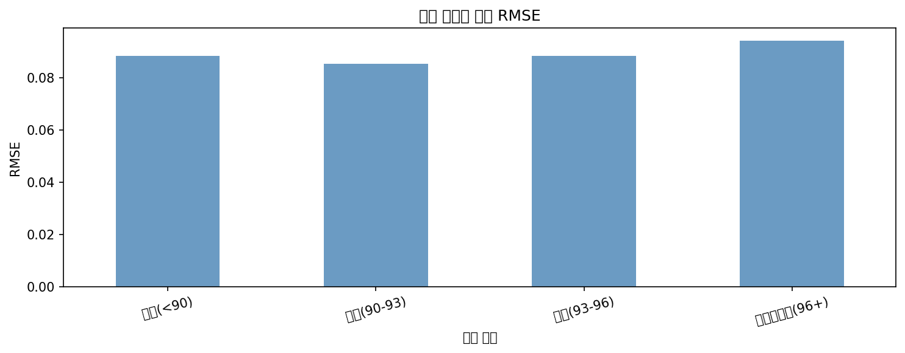

# ⚾ MLB 선발투수 컨디션 조기 예측

> **경기 초반 15구만 보고, 그날 투수의 남은 경기 컨디션을 맞출 수 있을까?**
> Statcast 투구 데이터 + 영상 생체역학(MediaPipe)을 융합해 검증한 ML 프로젝트

[](https://www.python.org/)
[](https://xgboost.readthedocs.io/)
[](https://developers.google.com/mediapipe)

## 목차

1. [프로젝트 개요](#1-프로젝트-개요)
2. [기술 스택](#2-기술-스택)
3. [주요 결과](#3-주요-결과)
4. [영상 생체역학 파이프라인](#4-영상-생체역학-파이프라인---statcast에-없는-정보를-찾아서)
5. [정직하게 기각한 가설들](#5--정직하게-기각한-가설들-이-프로젝트의-핵심)
6. [모델은 언제 맞고 언제 틀리나](#6-모델은-언제-맞고-언제-틀리나-오차-분석)
7. [프로젝트 구조](#7-프로젝트-구조)
8. [실행 방법](#8-실행-방법)
9. [다음 단계](#9-다음-단계)

---

## 1. 프로젝트 개요

### 동기 — 왜 이 프로젝트를 시작했나

야구 중계에서 해설자는 "오늘 저 투수 공이 좋다"는 말을 자주 합니다. 하지만 그 판단은 대개 **경기가 몇 이닝 진행된 뒤, 실점을 하고 나서야** 나옵니다.
스탯캐스트 데이터에는 투구 하나하나의 구속·회전수·궤적까지 다 담겨 있는데, 왜 그 판단을 **더 일찍** 데이터로 내릴 수는 없을까 — 라는 질문에서 이 프로젝트를 시작했습니다.

### 이 프로젝트가 푸는 문제

- **핵심 철학**: 이 투수가 "**누구인가**"(통산 성적·이름값)가 아니라 "**오늘 어떤 상태인가**"(컨디션)를 예측한다.
- **문제 정의**: 경기 초반 15구(X구간)의 투구 지표 → **이후 타석의 whiff%(헛스윙률)** 예측
- **활용 시나리오**: 조기 교체 판단, 불펜 준비 타이밍, 중계 인사이트
- **기간 / 인원**: 2026.05 ~ 07 (약 2개월) / **2인 팀** — 본인은 **정형 모델링 전담 + 영상 파이프라인 슬롯 0~2**

| 항목 | 내용 |
|---|---|
| 데이터 | Baseball Savant (Statcast) **2021~2025 5시즌** |
| 대상 | MLB 30팀 **선발투수** (불펜은 투구수 부족으로 X/Y 구간 분리 불가) |
| 규모 | **정형 23,225경기** / 이 중 **영상 매칭 3,783경기** (투구 영상 클립 약 5.7만 개) |
| 단위 | 1 row = 1경기 (`game_pk` × `pitcher`) |
| 분할 | **시즌 기반** — Train 2021\~2023 / Val 2024 / **Test 2025** (랜덤 분할 금지: leakage 방지) |



> 예측 whiff% vs 실제 whiff% (Val/Test). 대각선에서 멀지만, 왜 이 정도가 "기대할 수 있는 최선"인지는 3장에서 설명합니다.

---

## 2. 기술 스택

| 분류 | 사용 기술 |
|---|---|
| **언어 / 처리** | Python, pandas, NumPy, **DuckDB** (수천만 행 투구 데이터 SQL 집계) |
| **모델링** | **XGBoost**, LightGBM, CatBoost, scikit-learn, **Optuna** (하이퍼파라미터 튜닝) |
| **해석 / 검증** | **SHAP**, SciPy (**paired t-test**), 통계적 유의성 검정 |
| **영상 처리** | **MediaPipe Pose**(관절 추출), **YOLOv8**(투수 검출), PySceneDetect(컷 분할), OpenCV |
| **수집** | requests, BeautifulSoup (Baseball Savant 크롤링) |
| **환경** | Google Colab (GPU) + VS Code 원격, Google Drive |

---

## 3. 주요 결과

### 🏆 최종 모델 — 정형 Statcast 단독

| 지표 | 값 |
|---|---|
| Test **R²** | **0.0344** |
| Test RMSE | 0.0885 |
| Feature 수 | 59 |
| 모델 | XGBoost (Optuna 튜닝) |

> **R²가 낮은데 왜 성공인가?**
> 선행 연구에서도 구속으로 ERA를 예측하면 **R² ≈ 0.05~0.08**, 시즌 누적 지표조차 0.3~0.4가 천장입니다.
> 이 프로젝트는 **경기 단위 + 초반 15구**라는 훨씬 어려운 조건이므로, R² 0.034는 **문제의 천장에 근접한 값**입니다.
> ([98_참고논문/08](98_참고논문/08_추가수집_타겟평가지표.md) 참조)

### 🎯 "값" 대신 "상태"를 맞추면 — 컨디션 이진 분류

정확한 whiff% 값 예측은 어렵지만, **"오늘 컨디션이 좋은 날인가?"**로 문제를 바꾸면 실용적인 성능이 나옵니다.
(whiff% 상위 33% = 좋은 날 / 하위 33% = 나쁜 날)

| 모델 | Val AUC | Test AUC | '좋은 날' Recall |
|---|---|---|---|
| **XGBClassifier (정형)** | **0.651** | 0.597 | **74%** |

→ **경기 초반 15구만으로 "오늘 컨디션 좋은 날"을 AUC 0.65로 구분 가능.**

### 💡 문제 재정의가 최대 성과 — 타겟을 바꿔 9배 개선

| 타겟 (Y) | R² | 판정 |
|---|---|---|
| wOBA Against (초기 설정) | ~0.005 | ❌ 수비 운·상대 타자 노이즈 과다 |
| **whiff% (헛스윙률)** | **~0.08** | ✅ **투수가 직접 통제하는 지표 → 채택** |

4개 타겟(whiff / xwOBA / FIP / ERA)을 전부 비교한 결과 **whiff%만 예측 가능**했습니다.
"모델을 더 좋게" 만들기 전에 **"예측 가능한 문제인가"를 데이터로 검증**한 것이 이 프로젝트의 첫 번째 전환점입니다.

### 🔍 SHAP — 컨디션의 정체



**컨디션 신호 Top 5**: `평균 구속` · **`구속 변동성(std)`** · `회전수` · `평소 대비 기준선(prev)` · `릴리스 포인트`

→ **컨디션 = 절대 구속·회전수 + 얼마나 일정한가(변동성) + 평소 대비 어떤가**

---

## 4. 영상 생체역학 파이프라인 — Statcast에 없는 정보를 찾아서

Statcast는 구속·회전수 같은 "공의 결과"는 정밀하게 담지만, **투수의 몸이 어떻게 움직였는지**는 담지 않습니다.
"오늘 폼이 무너졌다"는 감각을 데이터로 잡아낼 수 있지 않을까 — 라는 가설로, 투구 영상에서 직접 관절 좌표를 추출하는 파이프라인을 처음부터 설계했습니다.

<p float="left">
  
  
</p>

> 좌: 검출 실패 사례 — 움직임이 큰 타자를 투수로 잘못 인식. 우: 검출 성공 사례 — 실제 투구 동작 중인 투수를 정확히 특정해 릴리스 순간(빨간 점)까지 잡아낸 결과. 이런 오검출 케이스를 걸러내는 필터링 로직이 파이프라인의 핵심 작업 중 하나였습니다.

```
9초 클립 다운로드
     │
     ▼
컷 분할 (PySceneDetect)  ──▶  투구 장면만 필터링 (YOLOv8 사람 검출 + 그라운드 비율)
     │
     ▼
투수 선택 (전신 키포인트 존재 + 화면상 y좌표 최대)
     │
     ▼
릴리스 프레임 특정 (팔 뻗음×속도 최대 시점)
     │
     ▼
MediaPipe Pose → 14개 관절 좌표 추출
     │
     ▼
좌투 미러링 → 어깨너비 정규화 → 이상치 윈저라이징
     │
     ▼
각도 9종 계산 (stride, arm_slot, shoulder_tilt, hip_tilt, trunk_angle, separation …)
     │
     ▼
경기 단위 집계 (mean/std/mean_std/full9 × 초반 3/5/10/15구)
```

- **처리량**: 5시즌 × 5슬롯 분산 처리로 투구 영상 약 5.7만 개 → 3,783경기 매칭
- **좌투 미러링**: 좌/우투수를 던지는 팔(오른팔) 기준으로 통일해 같은 기준으로 비교 가능하게 처리
- **정규화**: 카메라 각도·투수 체격 차이를 제거하기 위해 어깨너비 기준으로 정규화



> 클립 필터링 전(회색) vs 투구 장면만 남긴 후(파랑) whiff% 분포. 노이즈 클립을 걸러내도 분포 형태가 유지되는 것으로 필터링 품질을 검증했습니다.

**이렇게 만든 영상 feature를 정형 모델에 융합하면 정말 예측력이 올라갈까?** — 그 검증 결과는 다음 장에서 다룹니다.

---

## 5. ⭐ 정직하게 기각한 가설들 (이 프로젝트의 핵심)

성능을 부풀리는 대신, **세운 가설을 통계로 검증하고 아닌 것은 아니라고 보고**했습니다.
모든 검증은 **30개 seed × paired t-test**로 일관되게 수행했습니다.

### ❌ 가설 1. "평소 대비 편차(delta) feature가 컨디션을 잡아낼 것이다"

기획 단계의 **핵심 아이디어**였습니다. "오늘 구속 - 직전 시즌 평균 구속" 같은 개인 기준선 대비 편차야말로 컨디션이라고 봤습니다.

- **결과**: paired t-test(30 seed) → 정형 vs 정형+delta **차이 평균 ≈ 0, 절반은 오히려 음수**
- SHAP에서도 delta 계열은 **전부 하위권**. 상위는 `total_pitches`, `avg_speed` 등 **절대값**
- **→ 기각.** 다만 delta의 형제 격인 **`prev`(기준선)와 `std`(변동성)는 살아남아** 최종 모델에 포함

### ❌ 가설 2. "영상 생체역학(투구 자세)을 융합하면 개선될 것이다"

앞장에서 만든 영상 feature(각도 9종)를 정형 모델에 그대로 융합해 검증했습니다.

| 검증 | 결과 |
|---|---|
| whiff% 융합 (30 seed) | ΔR² **-0.0092**, **p ≈ 9.6×10⁻⁷** → ✅ **통계적으로 유의하게 악화** |
| SHAP 상위 5/10/15/20개만 융합 | 전부 **무의** (p > 0.05) |
| **영상 단독** 모델 | Val R² **0.0003** → 예측력 거의 0 |
| 새 타겟(제구: zone%/ball%)으로 재검증 | zone% **-0.0065 (p=0.0006, 악화)** / ball% 무의 |
| Subgroup(좌우투·폼 변동성·오차 구간)별 분석 | 어느 그룹에서도 **일관된 기여 없음** |

> **1차(절반 데이터)에서는 "무의(p>0.05)"였으나, 전체 데이터(3.3배)로 재검증하자 "유의하게 악화"로 결론이 명확해졌습니다.**
> 표본을 늘려 결론의 신뢰도를 높인 과정 자체가 이 실험의 성과입니다.



> 좌: SHAP Top 30 (파랑=정형, 주황=영상) — 영상 feature는 11위부터 등장. 우: feature 그룹별 평균 |SHAP| — 정형(0.00070)이 영상(0.00032)의 2배 이상.

**왜 안 됐나 (원인 규명):**
1. **상관 자체가 약함** — 영상 각도 vs 타겟 `|r| ≈ 0.02` (정형의 절반 수준)
2. **정형과의 중복 때문이 아님** — 영상으로 정형을 예측해봐도 R² = 0.10에 그침 (독립적이지만 무의미한 정보)
3. **"릴리스 순간 정지 1프레임"의 한계** — 자세의 *변화·타이밍*이 아닌 정지 각도만으론 공의 위력을 설명 못 함

> 💡 **얻은 교훈: SHAP 중요도 ≠ 예측 기여.**
> 영상 피처가 SHAP 중위권에 올라도, 실제로 융합하면 성능이 떨어졌습니다.
> 트리 모델이 "변동성 있는 피처를 split에 썼을 뿐"이며, **중요도 랭킹만 보고 피처를 채택하면 안 된다**는 것을 실험으로 확인했습니다.

### ❌ 그 외 기각된 가설
- **결측 처리 전략 5종**(0 impute, NaN 비율 기준 컬럼 제거 등) → baseline(모델 내부 처리)이 최선
- **이상치 처리 4종**(구속 clip, 극단 whiff% 경기 제거) → 오히려 정보 손실
- **시퀀스 모델 / changepoint 탐지** → 유의한 개선 없음

---

## 6. 모델은 언제 맞고 언제 틀리나 (오차 분석)

"평균 R²"만 보고하면 모델을 실제로 쓸 수 없습니다. **어떤 투수에게 신뢰할 수 있는지** 쪼개서 확인했습니다.



| 투수 유형 | Test R² | 분류 AUC | 해석 |
|---|---|---|---|
| **파워형** (구속↑) | **+0.018** | **0.63** | ✅ 모델이 잘 맞는 구간 — 구속·회전수 신호가 뚜렷 |
| 핀포인트형 (제구 위주) | -0.024 | 0.58 | ⚠️ 예측 어려움 — 위력이 아닌 제구로 승부 |

- 예측값 전반에 **bias -0.013**(과소 예측)이 존재 → **보정 가능한 계통 오차**로 확인
- **→ 결론: "모든 투수"가 아니라 "파워형 투수에게 우선 적용"이라는 실용 범위를 정의**

---

## 7. 프로젝트 구조

```
투수 컨디션 예측/
├── 1_statcast/                   # 정형 데이터 파이프라인
│   ├── 01_data_collection.ipynb      # Baseball Savant 수집 (2021~2025)
│   ├── 02_preprocessing.ipynb        # 선발투수 필터 · 구종 그룹핑
│   ├── 03_feature_engineering.ipynb  # X구간 집계 → feature 생성
│   └── 04_build_targets.ipynb        # 타겟 4종 + 제구 타겟 3종 생성
│
├── 2_video/                      # 영상 생체역학 파이프라인
│   ├── 01_video_download.ipynb       # 투구 클립 다운로드 (5슬롯 분할)
│   ├── 02_video_collect.ipynb        # play_id 크롤링 (+ 크롤링 버그 A/B 검증)
│   ├── 03_skeleton.ipynb             # 컷분할 → 투수 검출 → 릴리스 → MediaPipe 14관절
│   ├── 04_video_pipeline.ipynb       # 좌표 → 각도 → 경기 단위 집계
│   └── video_features.py         ⭐  # 위 파이프라인 로직 모듈화
│
├── 3_modeling/
│   ├── 1_pipeline/               # 최종 모델로 이어지는 본류
│   │   ├── 04_baseline.ipynb         # 베이스라인 (여기서 wOBA → whiff% 전환)
│   │   ├── 06_x_interval_experiment  # X구간 실험 → pitch 15구 확정
│   │   ├── 07_delta_experiment       # ❌ delta 가설 기각
│   │   ├── 10_tuning_experiment      # Optuna 튜닝
│   │   ├── 11_feature_selection      # 피처 선택 (59개 확정)
│   │   └── 13_final_evaluation       # 최종 평가 + 오차 분석
│   │
│   ├── 2_experiments/            # 검증 실험 (대부분 기각)
│   │   ├── 05_nan_experiment · 09_outlier_experiment
│   │   ├── 12_biomechanical_experiment  ⭐ 영상 융합 검증 (기각)
│   │   ├── 14_domain_feature · 15_sequence_model · 16_changepoint
│   │
│   ├── 3_analysis/               # 해석
│   │   ├── 08_shap_analysis          # SHAP — 컨디션의 정체
│   │   ├── 18_target_comparison      # 타겟 4종 비교
│   │   └── 19_condition_classification # ⭐ 컨디션 이진 분류 (AUC 0.65)
│   │
│   ├── feature_aggregator.py     ⭐  # X구간별 feature 집계 (핵심 모듈)
│   ├── x_interval_experiment.py      # X구간 실험 로직
│   ├── nan_strategies.py / outlier_handler.py
│
├── 4_output/                     # 실험 결과 CSV · 모델 · 시각화(figures/)
├── 5_eda/                        # 타겟 분포 EDA
└── 98_참고논문/                   # 선행 연구 정리 (R² 천장 근거)
```

> 📍 **노트북 전체 인덱스**: [00_노트북_지도.md](00_노트북_지도.md)
> 📍 **실험 결과 원본**: [4_output/experiment_results.md](4_output/experiment_results.md)
>
> 💡 **설계 원칙**: 노트북 = *실행 · 기록*, `.py` = *재사용 함수*.
> 반복 사용되는 로직(feature 집계, 영상 각도 계산)은 모듈로 분리해 여러 노트북이 `import`합니다.

---

## 8. 실행 방법

```bash
git clone https://github.com/seong-eun822/mlb_pitcher_condition_prediction.git
cd mlb_pitcher_condition_prediction
pip install -r requirements.txt
```

### 정형 파이프라인 (로컬 실행 가능 — GPU 불필요)
```
1_statcast/01 → 02 → 03 → 04     # 데이터 수집 → 피처 → 타겟
3_modeling/1_pipeline/04 → 06 → 07 → 10 → 11 → 13   # 베이스라인 → 튜닝 → 최종 평가
```

### 영상 파이프라인 (Google Colab GPU 권장)
```
2_video/01 → 02 → 03 → 04        # 다운로드 → play_id → 관절 추출 → 각도 집계
3_modeling/2_experiments/12       # 정형 vs 정형+영상 융합 검증
```

> ⚠️ 원본 데이터(`0_data/`)와 영상 클립은 용량 문제로 저장소에 포함되지 않습니다.
> `01_data_collection.ipynb`를 실행하면 Baseball Savant에서 재수집됩니다.
> 노트북은 `IN_COLAB` 자동 감지로 Colab / 로컬 양쪽에서 동작합니다.

---

## 9. 다음 단계

- **투구 순서 복원**: 현재 Statcast에는 `pitch_number`가 있지만 `play_id`가 없어, "진짜 초반 N구"를 영상과 정확히 이을 수 없습니다. `play_id` 포함 재수집 시 정밀화 가능
- **영상의 재도전 방향**: 정지 1프레임이 아닌 **릴리스 전후 시퀀스(동작 궤적)** 로 접근
